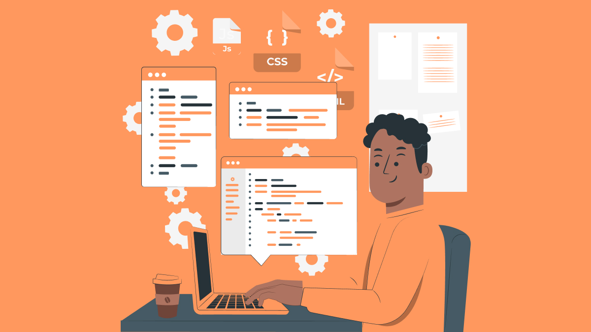

  <strong></>Olá! 👋</></strong>   

  </>Meu nome é Jean Rufino, sou <strong>desenvolvedor web</strong>, com foco em <strong>frontend e experiência do usuário</strong>.  
  Ainda não possuo experiência no mercado, mas estou em busca de oportunidades para me aprimorar cada vez mais! Veja meus repositórios!</>

  🚀 Tecnologias: <strong>HTML5</strong>, <strong>CSS3</strong>, <strong>Bootstrap</strong>, <strong>Python</strong>, <strong>JavaScript</strong>, <strong>Git/Github</strong>.

  

