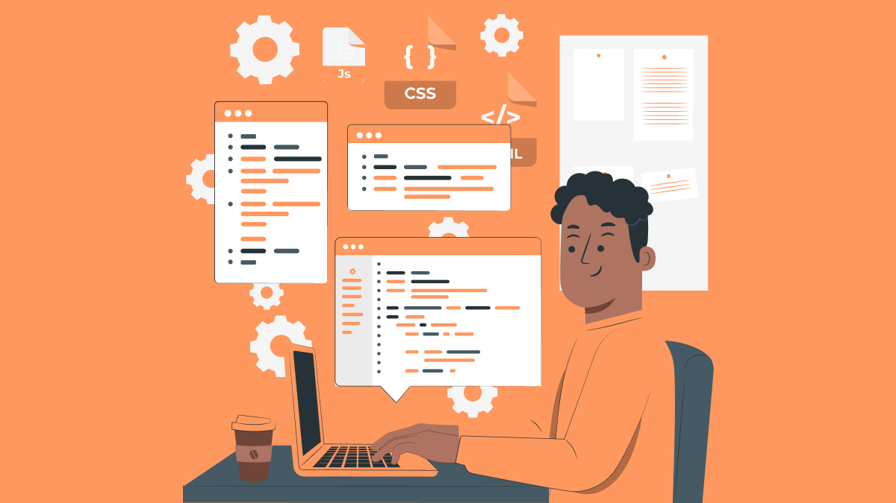

  

 

  <strong>Olá! 👋</strong>

  Meu nome é <strong>Jean Rufino</strong>. Sou profissional em <strong>Engenharia de Dados e Inteligência Artificial</strong>, com forte foco na <strong>orquestração de workflows</strong>, <strong>arquiteturas RAG</strong> e <strong>pipelines escaláveis</strong>.

  Atuo no design e implementação de soluções automatizadas para embasar decisões corporativas de ponta a ponta e no desenvolvimento de ferramentas web robustas, combinando <strong>integração de sistemas</strong>, <strong>RPA</strong> e <strong>IA generativa</strong>.

  🤖 <strong>IA & LLMs:</strong> Arquiteturas RAG integradas a APIs de LLMs (OpenAI, Claude), LangChain, LangGraph, bancos de dados vetoriais e engenharia de prompts.

  ⚙️ <strong>Automação & Engenharia de Dados:</strong> n8n, Apache Spark, Databricks, Airflow, dbt, Apache Flink, Selenium, Robot Framework e desenvolvimento de microsserviços em Python (Flask/Django).

  📊 <strong>Dados & BI:</strong> PostgreSQL, SQL Server, MongoDB, Elasticsearch, Snowflake, BigQuery, Redshift, modelagem de dados e dashboards avançados com Power BI e Grafana.

  ☁️ <strong>Cloud & DevOps:</strong> AWS, Azure, Docker, Kubernetes, Terraform, RabbitMQ e servidores Linux/Windows.

  💻 <strong>Desenvolvimento Web:</strong> JavaScript, TypeScript, React, Next.js, Tailwind CSS e HTML/CSS.

  Meus projetos vão desde a <strong>automação de processos críticos de KYC/Onboarding</strong> até a criação de 
  <strong>plataformas educacionais B2B</strong>, <strong>agentes operacionais inteligentes</strong> e <strong>sistemas gerenciais corporativos</strong>.

  

